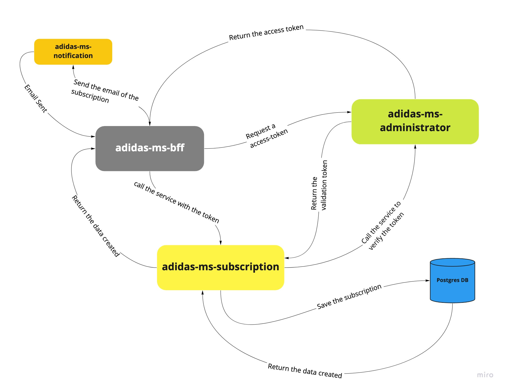

# Subscription System

SUBSCRIPTION SYSTEM. The System content three microservices:

## Public Service

A Backend for Frontend microservice, this microservice to UI frontend, is developed with GraphQL

## Subscription Service

Microservice implementing subscription logic, including the persistence of
subscription data in a database and email notification to confirm the process is completed.

## Email Service

Microservice implementing email notifications. This service returns a Mock interface.

The subscription System provide these operations:

- Create new subscription
- Cancel existing subscription
- Get details of a subscription
- Get all subscriptions

## Admin Token Service

Microservice to create, generate and verify a **access token** to call the private services

The technologies used to develop it were:

- NodeJS
- ExpressJS
- GraphQL
- Docker
- PostgreSQL
- Jest

## The enpoints are

### GraphQL BFF

- [POST] `<HOST>/graphql` Up the Apollo Server to GraphQL Services.

### Subscription Collection

- [POST] `<HOST>/subscription` Create a user subscription.
    This service must content the next request:
    ```json
    {
	    "email": "test@gmail.com",
        "birthDay": "1990-02-25",
        "consent": true,
        "gender": "Male",
        "firstName": "Ivano"
    } 
    ```

- [GET] `<HOST>/subscription?limit=10&page=1` Get all subscriptions, the endpoint can receives the `limit` and `page` parameter for a pagination
- [GET] `<HOST>/subscription/:subscriptioID` Get the detail of subscription, the endpoint receives the **subscriptionID** as url param
- [DELETE] `<HOST>/subscription/:email` Delete a subscription, the endpoint receives the **email** as url param

### Admin Token Collection

- [POST] `<HOST>/admin-token/create` Create a admin user to generate the access token to call the private services.
    This service must content the next request:
    ```json
    {
	    "username": "administrator",
	    "password": "3D9188577CC9BFE9291AC66B5CC872B7"
    } 
    ```

- [POST] `<HOST>/admin-token/login` Service to generate the access token to call the private services.
    This service must content the next request:
    ```json
    {
	    "username": "administrator",
	    "password": "3D9188577CC9BFE9291AC66B5CC872B7"
    } 
    ```

- [POST] `<HOST>/admin-token/verify-token` Service to verify the access token to call the private services.
    This service must content the next request:
    ```json
    {
	    "token": "<jwt-token>"
    } 
    ```

### Notification Collection

- [POST] `<HOST>/notification/send-email` Service to send the email notification.
    This service must content the next request:
    ```json
    {
		"email": "ivanojgarcia@gmail.com"
    } 
    ```

## Flow to create a subscription



## Requirements

For development, you will only need Node.js and a node global package, Yarn, installed in your environement and Docker.

### Node
- #### Node installation on Windows

  Just go on [official Node.js website](https://nodejs.org/) and download the installer.
Also, be sure to have `git` available in your PATH, `npm` might need it (You can find git [here](https://git-scm.com/)).

- #### Node installation on Ubuntu

  You can install nodejs and npm easily with apt install, just run the following commands.
  
```shell
    $ sudo apt install nodejs
    $ sudo apt install npm
```

#### Other Operating Systems

  You can find more information about the installation on the [official Node.js website](https://nodejs.org/) and the [official NPM website](https://npmjs.org/).

If the installation was successful, you should be able to run the following command.

```shell
    $ node --version
    v12.22.9

    $ npm --version
    8.4.1
```

If you need to update `npm`, you can make it using `npm`! Cool right? After running the following command, just open again the command line and be happy.

`$ npm install npm -g`

###
### Yarn installation
  After installing node, this project will need yarn too, so just run the following command.

  `$ npm install -g yarn`

---
### Docker Instalations

You can see the Docker documentation [here](https://docs.docker.com/engine/install/)

## Install and run the Microservices

### Clone the repositorie

  ```shell 
    git clone https://ivanojgarcia@bitbucket.org/ivanojgarcia/adidas-challenge.git
    $ cd adidas-challenge
  ```

You can up all images Docker with the next command.

1. **Build the images:** `docker-compose -f docker-compose.yml build`
2. **Up the all services:** `docker-compose -f docker-compose.yml up -d`
3. **Down all services:** `docker-compose -f docker-compose.yml down`

The `docker-compose.yml` file contain the postgres database image and all conections to integrate the services.

The service run in the next ports:

- **adidas-ms-subscription:** 3000
- **adidas-ms-administrator:** 4000
- **adidas-ms-notification:** 6000
- **adidas-ms-bff:** 8000

The database run in port 5432 as the default.
## Configure app and aditional scripts

For good functionality is necessary that the first admin user will be created. The user into the .env file as Machine to Machine user is:

```text
"username": "administrator",
"password": "3D9188577CC9BFE9291AC66B5CC872B7"
```

To create the administrator user with these credentials is necessary to execute the endpoint `http://localhost:4000/admin-token/create`, the payload to send will be must:

```json
{
	"username": "administrator",
	"password": "3D9188577CC9BFE9291AC66B5CC872B7"
}
```

> **Important:** If the user m2m was created with other data or credentials, you must change the values to user M2M (machine to machine) in the **bff** service into the .env variables (e.g: `USER_M2M=administrator` , `PASS_M2M=3D9188577CC9BFE9291AC66B5CC872B7`)


The project has the environment variables associated with each environment, which are segmented into .env files depending on the environment we have:

- `.env` for production
- `env.dev` for development
- `.env.test` for testing

There are in turn different scripts that improve the understanding and standard of the code among those we have:

- `$ yarn lint` With this we evaluate and solve linting problems
- `$ yarn format` With this script we format the code en base a los estandares de prettier
- `$ yarn prettier:check` With this script we can take the warning or bad formatted code by files

## Running the Unit Test

As good practices, it is suggested that each critical or logical method carry its corresponding unit test, for this some tests were added that can evaluate the different critical cases of functionality

For that we must execute the next script `yarn test`
## Running the project

- `$ yarn start` to production
- `$ yarn start:dev` to dev or local stage
- `$ yarn start:test` to testing stage


## Simple build for production

`$ yarn build`
